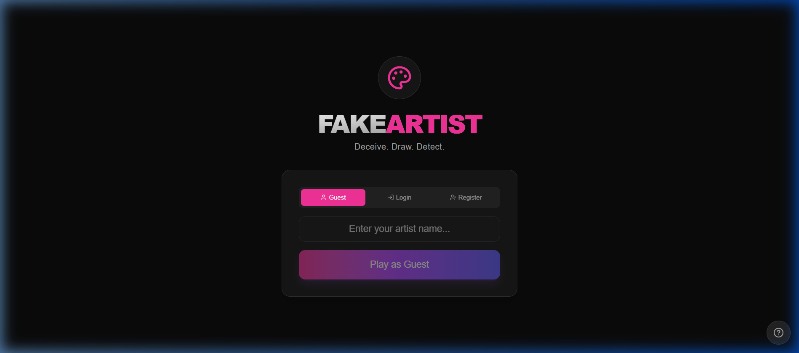
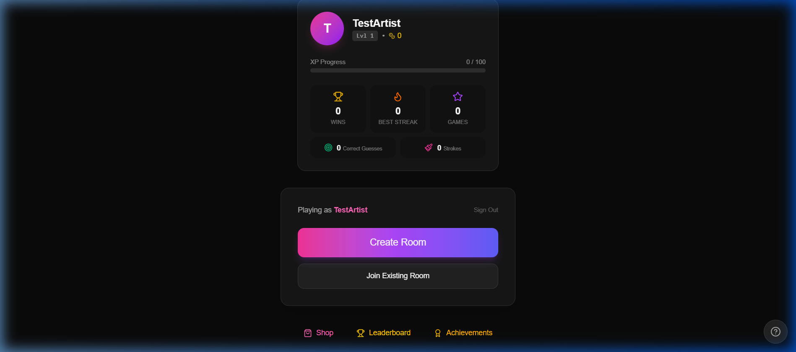
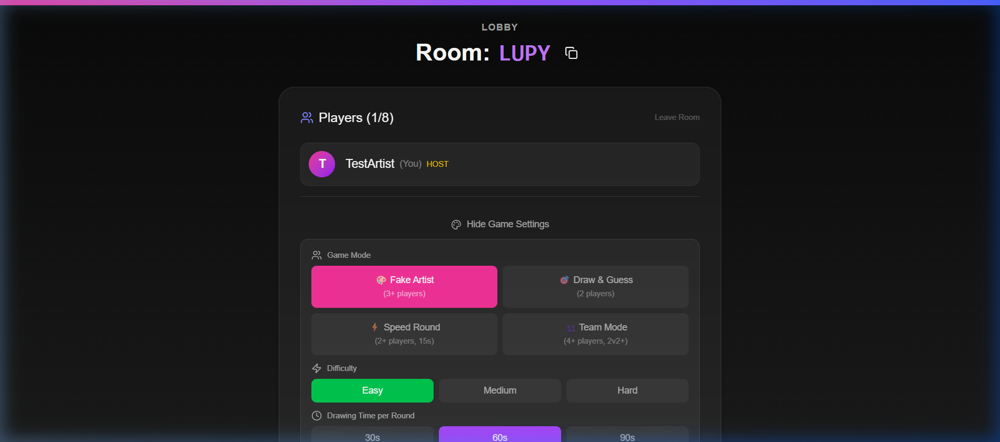
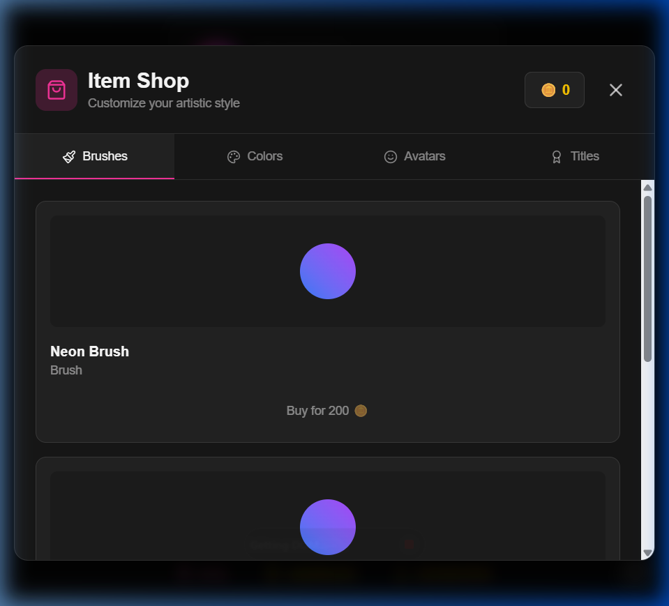
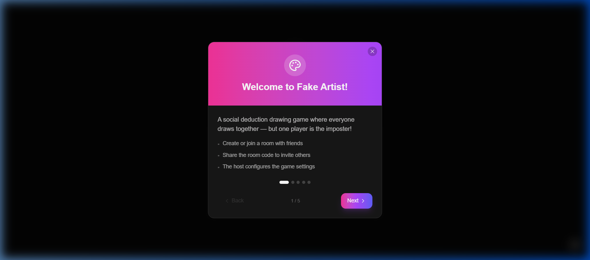

<div align="center">

# 🎨 FAKE ARTIST

### *Deceive. Draw. Detect.*

A real-time multiplayer party game where everyone draws together — except one player who doesn't know the secret word. Can you find the **Fake Artist** before they blend in?

[](https://fake-artist-phi.vercel.app/)
[](https://fake-artist-3d5c.onrender.com)
[](https://github.com/oggigachad/fake-artist)

</div>

---

## 📸 Screenshots

<div align="center">

| Landing Page | Player Dashboard |
|:---:|:---:|
|  |  |

| Game Lobby & Settings | Item Shop |
|:---:|:---:|
|  |  |

| Onboarding |
|:---:|
|  |

</div>

---

## 🎮 Game Modes

| Mode | Players | Description |
|------|---------|-------------|
| 🎭 **Fake Artist** | 3+ | Everyone draws on a shared canvas. One player is secretly the Fake Artist who received a *different* word. Vote to find them! |
| ✏️ **Draw & Guess** | 2 | Classic draw-and-guess — one player draws, the other guesses the word. Take turns across 5 rounds. |
| ⚡ **Speed Round** | 2+ | Draw & Guess on steroids — 15 seconds per round. Fast reflexes only! |
| 👥 **Team Mode** | 4+ | 2v2+ with a Fake Artist on each team. Coordinate with your team to find the impostor! |

---

## ✨ Features

- 🔌 **Real-Time Multiplayer** — Powered by Socket.IO with WebSocket transport
- 🔐 **Authentication** — Guest login, email registration, or full account with JWT
- 🏠 **Private Rooms** — Create rooms with shareable codes, up to 8 players
- ⚙️ **Customizable Settings** — Difficulty, round time (30s/60s/90s), word packs, game modes
- 💰 **Economy System** — Earn coins & XP for playing, level up your profile
- 🛒 **Cosmetic Shop** — Buy custom brushes (Neon, Galaxy, Rainbow), colors, avatars, and titles
- 🏆 **Leaderboards & Achievements** — Compete globally, unlock 20+ achievements
- 📊 **Player Stats** — Track wins, streaks, games played, correct guesses, and total strokes
- 🔄 **Reconnection Support** — Drop connection mid-game? Rejoin seamlessly within 30 seconds
- 📱 **Responsive Design** — Plays great on desktop and mobile
- 🎨 **Interactive Onboarding** — Step-by-step tutorial for new players

---

## 🛠️ Tech Stack

### Frontend
| Technology | Purpose |
|---|---|
| [Next.js 16](https://nextjs.org/) | React framework with App Router |
| [React 19](https://react.dev/) | UI library |
| [TypeScript](https://www.typescriptlang.org/) | Type safety |
| [Tailwind CSS v4](https://tailwindcss.com/) | Utility-first styling |
| [Framer Motion](https://www.framer.com/motion/) | Animations & transitions |
| [Socket.IO Client](https://socket.io/) | Real-time communication |

### Backend
| Technology | Purpose |
|---|---|
| [Node.js](https://nodejs.org/) | Runtime |
| [Express](https://expressjs.com/) | HTTP server & REST API |
| [Socket.IO](https://socket.io/) | WebSocket server |
| [TypeScript](https://www.typescriptlang.org/) | Type safety |
| [Better-SQLite3](https://github.com/WiseLibs/better-sqlite3) | Embedded database |
| [JWT](https://jwt.io/) | Authentication tokens |
| [bcrypt](https://www.npmjs.com/package/bcryptjs) | Password hashing |

### Deployment
| Service | Usage |
|---|---|
| [Vercel](https://vercel.com/) | Frontend hosting |
| [Render](https://render.com/) | Backend hosting |

---

## 📁 Project Structure

```
fake-artist/
├── client/                     # Next.js frontend
│   ├── src/
│   │   ├── app/                # Pages (home, lobby, game)
│   │   │   ├── page.tsx        # Landing page with auth
│   │   │   ├── lobby/[roomId]/ # Pre-game lobby
│   │   │   └── game/[roomId]/  # In-game canvas & UI
│   │   ├── components/         # Reusable UI components
│   │   │   ├── CanvasBoard.tsx # Drawing canvas
│   │   │   ├── ShopModal.tsx   # Cosmetics shop
│   │   │   └── UserProfile.tsx # Player stats card
│   │   ├── hooks/              # Custom React hooks
│   │   └── lib/                # Socket.IO client & utils
│   └── .env.production         # Production backend URL
├── server/                     # Express + Socket.IO backend
│   ├── index.ts                # Main server (1300+ lines)
│   ├── db.ts                   # SQLite database operations
│   ├── economy.ts              # Coins, XP & leveling logic
│   ├── shop.ts                 # Cosmetic items & inventory
│   ├── store.ts                # In-memory room management
│   ├── words.ts                # Word packs & categories
│   └── types.ts                # Shared TypeScript types
├── screenshots/                # README screenshots
└── .env                        # Environment variables
```

---

## 🚀 Getting Started

### Prerequisites

- **Node.js** v16 or higher
- **npm** or **yarn**

### 1. Clone the repository

```bash
git clone https://github.com/oggigachad/fake-artist.git
cd fake-artist
```

### 2. Install dependencies

```bash
# Server
cd server
npm install

# Client
cd ../client
npm install
```

### 3. Set up environment variables

```bash
# In project root
cp .env.example .env
# Edit .env and set a secure JWT_SECRET
```

### 4. Run the application

**Option A — Two terminals:**

```bash
# Terminal 1: Backend
cd server
npm run dev

# Terminal 2: Frontend
cd client
npm run dev
```

**Option B — Windows quick start:**

```bash
start.bat
```

The game will be available at:
- **Frontend:** http://localhost:3000
- **Backend:** http://localhost:3001

---

## 🔧 Development

```bash
# Server (auto-reload with nodemon)
cd server
npm run dev

# Server (production build)
npm run build
npm start

# Client (Next.js dev server)
cd client
npm run dev

# Client (production build)
npm run build
npm start
```

---

## 🐛 Troubleshooting

| Issue | Solution |
|---|---|
| Port 3000/3001 in use | Change `PORT` in `.env` and update `NEXT_PUBLIC_SERVER_URL` in `client/.env.local` |
| Database locked | Close other processes, delete `game.db-shm` and `game.db-wal` |
| Socket connection failed | Ensure backend is running, check CORS in `server/index.ts` |
| "Cannot GET /" on backend | A health check route exists at `/` — verify the server is deployed |

---

## 🌐 Deployment

### Frontend (Vercel)
1. Import the repo on [Vercel](https://vercel.com/)
2. Set root directory to `client`
3. Set env var: `NEXT_PUBLIC_SERVER_URL=https://your-backend-url.onrender.com`

### Backend (Render)
1. Create a new Web Service on [Render](https://render.com/)
2. Set root directory to `server`
3. Build command: `npm install && npm run build`
4. Start command: `npm start`
5. Set env vars: `JWT_SECRET`, `FRONTEND_URL`

---

## 👨‍💻 Author

<div align="center">

**Aakash Sarang**

[](https://mainportfolio-red.vercel.app/)
[](https://www.linkedin.com/in/aakash-sarang-38b681263/)
[](https://github.com/oggigachad)

</div>

---

## 📝 License

MIT © [Aakash Sarang](https://github.com/oggigachad)
